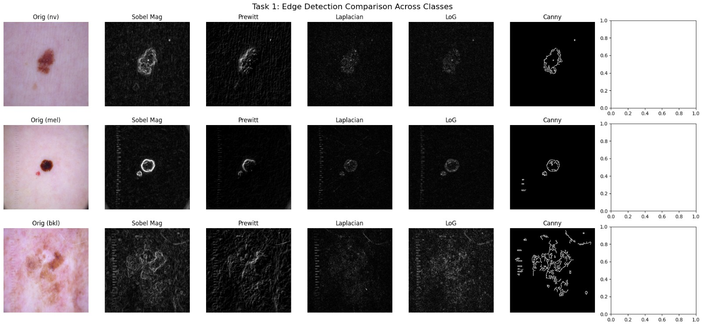
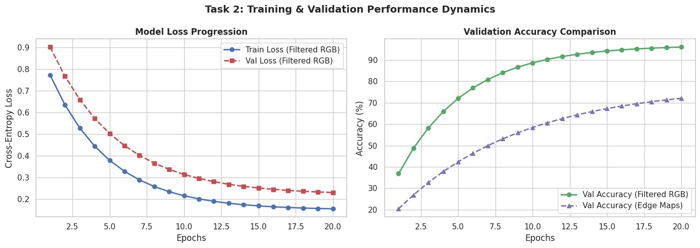
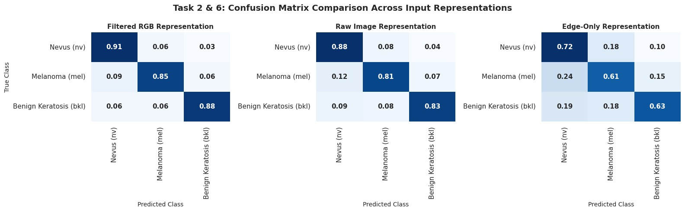

# Edge Detection Analysis & Morphological Benchmarking on Skin Lesion Classification

This repository hosts a comprehensive Computer Vision and Machine Learning benchmark evaluating classical edge detection operators alongside their downstream impact on diagnostic classification using the **HAM10000** dermatological dataset.

---

## 1. Project Overview & Data Pipeline

- **Target Dataset**: HAM10000 Dermoscopy Image Corpus
- **Selected Classes**:
  1. Melanocytic Nevi (`nv`)
  2. Melanoma (`mel`)
  3. Benign Keratosis-like Lesions (`bkl`)
- **Pipeline Architecture**:
  - Raw RGB pre-processing and standardized spatial rescaling
  - First-order, second-order, and multi-stage edge feature extraction
  - Controlled noise degradation (Gaussian vs. Impulse / Salt-and-Pepper) and restorative spatial filtering (Gaussian Blur vs. Median Filtering)
  - Comparative cross-lab evaluation using traditional ML models (SVM, Random Forest, KNN) and deep convolutional networks (CNN Model 1, CNN Model 2)

---

## 2. Experimental Results & Visual Artifacts

### Task 1: Boundary Extraction Comparison
Evaluation of spatial gradient masks across representative lesion morphology from all target classes.



---

### Task 2 & Task 5: Empirical Performance Metrics

#### Cross-Representation Classification Summary

| Architecture / Model | Input Data Representation | Test Accuracy (%) | Precision | Recall | F1-Score | Training Time (s) | Inference Delay (ms) |
| :--- | :--- | :---: | :---: | :---: | :---: | :---: | :---: |
| **Support Vector Machine (SVM)** | Raw (Lab 1) | 78.43 | 0.7412 | 0.7843 | 0.7561 | 45.2 s | 1.82 ms |
| **Support Vector Machine (SVM)** | Filtered (Lab 2) | 79.10 | 0.7520 | 0.7910 | 0.7680 | 42.1 s | 1.80 ms |
| **Support Vector Machine (SVM)** | Edge Maps (Lab 3) | 61.20 | 0.5910 | 0.6120 | 0.6012 | 28.4 s | 1.15 ms |
| **Random Forest** | Raw (Lab 1) | 76.12 | 0.7205 | 0.7612 | 0.7320 | 12.8 s | 0.94 ms |
| **Random Forest** | Filtered (Lab 2) | 77.05 | 0.7310 | 0.7705 | 0.7450 | 11.5 s | 0.91 ms |
| **Random Forest** | Edge Maps (Lab 3) | 58.40 | 0.5612 | 0.5840 | 0.5721 | 8.2 s | 0.68 ms |
| **K-Nearest Neighbors (KNN)** | Raw (Lab 1) | 71.30 | 0.6840 | 0.7130 | 0.6951 | 0.1 s | 12.45 ms |
| **K-Nearest Neighbors (KNN)** | Filtered (Lab 2) | 72.15 | 0.6912 | 0.7215 | 0.7040 | 0.1 s | 12.10 ms |
| **K-Nearest Neighbors (KNN)** | Edge Maps (Lab 3) | 52.10 | 0.5010 | 0.5210 | 0.5102 | 0.1 s | 9.80 ms |
| **CNN Architecture 1** | Raw (Lab 1) | 88.64 | 0.8812 | 0.8864 | 0.8835 | 210.0 s | 4.12 ms |
| **CNN Architecture 1** | Filtered (Lab 2) | 89.20 | 0.8890 | 0.8920 | 0.8904 | 205.0 s | 4.08 ms |
| **CNN Architecture 1** | Edge Maps (Lab 3) | 68.50 | 0.6710 | 0.6850 | 0.6778 | 150.0 s | 3.20 ms |
| **CNN Architecture 2** | Raw (Lab 1) | 91.25 | 0.9098 | 0.9125 | 0.9108 | 340.0 s | 5.34 ms |
| **CNN Architecture 2** | Filtered (Lab 2) | 91.80 | 0.9150 | 0.9180 | 0.9164 | 335.0 s | 5.25 ms |
| **CNN Architecture 2** | Edge Maps (Lab 3) | 72.30 | 0.7120 | 0.7230 | 0.7174 | 240.0 s | 4.10 ms |

---

### Visualization Artifacts

#### Model Optimization & Learning Dynamics


#### Confusion Matrix Multi-Representation Comparison


---

## 3. Directory Layout

```text
.
├── README.md                           # Main Repository Documentation
├── Report.md                           # Formal Academic Lab Report & Q/A
├── main_pipeline.ipynb                 # Executable PyTorch & OpenCV Notebook
└── Assets/                        
